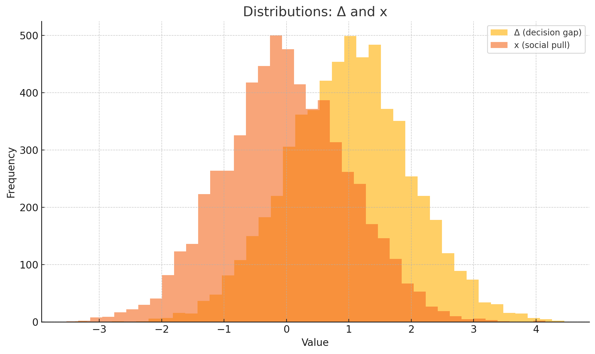
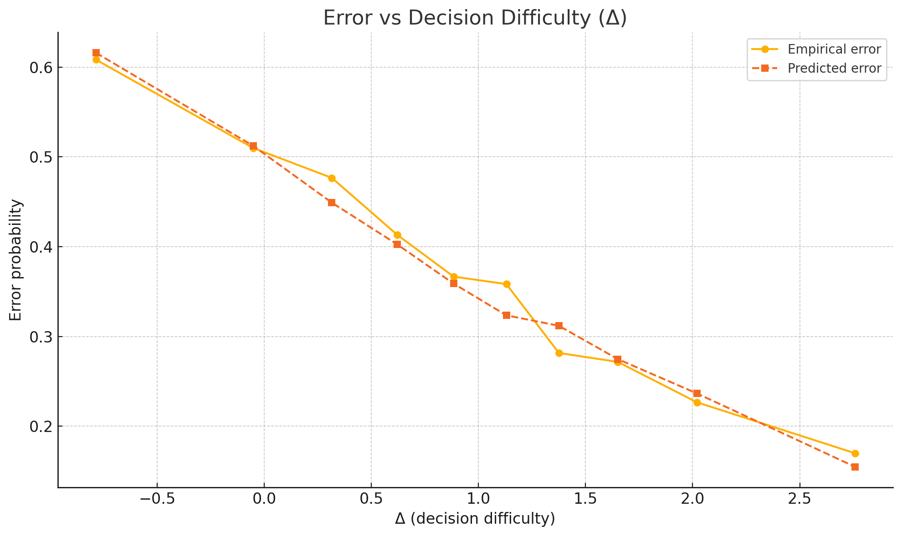
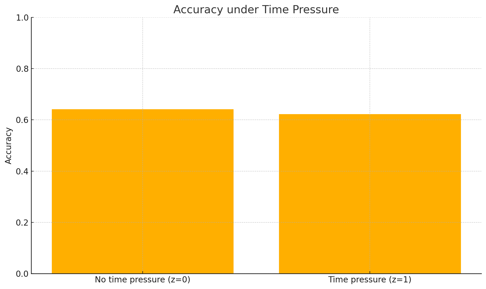
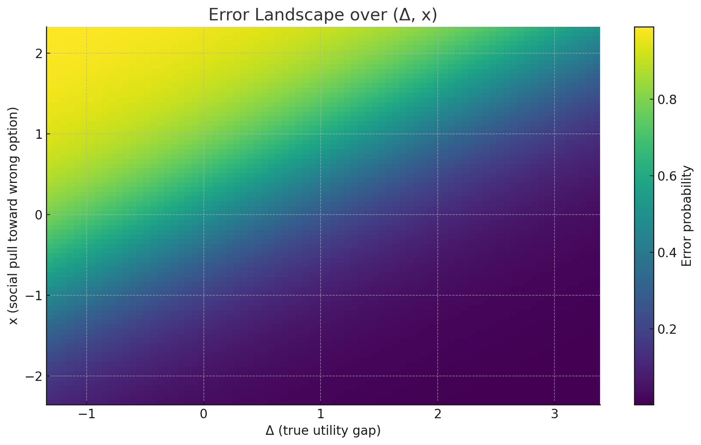

# Decision Error Generative Model (DEGM)

A unified, estimable model for **why people make wrong decisions**, with clean levers for information efficiency (κ), bias (b), friction (T), and noise (σ).
## 📊 Model Visualization

### 1️⃣ Distributions: Δ and Social Pull (x)


### 2️⃣ Error vs Decision Difficulty (Δ)


### 3️⃣ Accuracy under Time Pressure


### 4️⃣ Error Landscape



## Repo structure
```
DEGM_Model/
├── degm/
│   └── degm_model.py           # Simulation, MLE, charts, CLI
├── paper/
│   └── DEGM_Extended.tex       # LaTeX paper (Charter font, 0.5in margins, author: Amit Kumar Jha)
├── data/                       # Saved tables (created after running)
├── outputs/                    # Figures (created after running)
├── requirements.txt
├── LICENSE
└── README.md
```

## Install
```bash
python -m venv .venv
source .venv/bin/activate  # on Windows: .venv\Scripts\activate
pip install -r requirements.txt
```

## Quick start (simulate, estimate, plot)
```bash
python -m degm.degm_model --n 6000 --seed 42 --save
```

This will:
- simulate choices with ground-truth params,
- estimate (κ, β_b, T0, τ, σ) by MLE,
- write tables into `data/` and figures into `outputs/`,
- print a short summary to STDOUT.

## Options
```
--n INT           Number of decisions to simulate (default: 6000)
--seed INT        RNG seed (default: 42)
--no-plots        Skip saving figures
--no-counterf     Skip counterfactual sweep
--csv-only        Only save CSV tables
```

## Push to GitHub
```bash
git init
git add .
git commit -m "Initial commit: Decision Error Generative Model (DEGM)"
git branch -M main
git remote add origin https://github.com/AIM-IT4/DEGM_Model.git
git push -u origin main
```

---

**Cite:** A. K. Jha, "A Decision Error Generative Model (DEGM): Why People Make Wrong Decisions", 2025.
